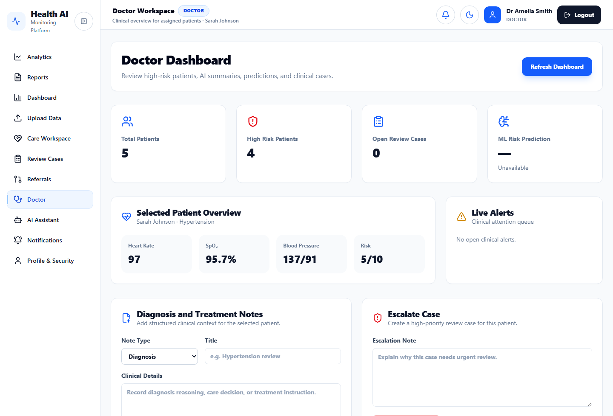
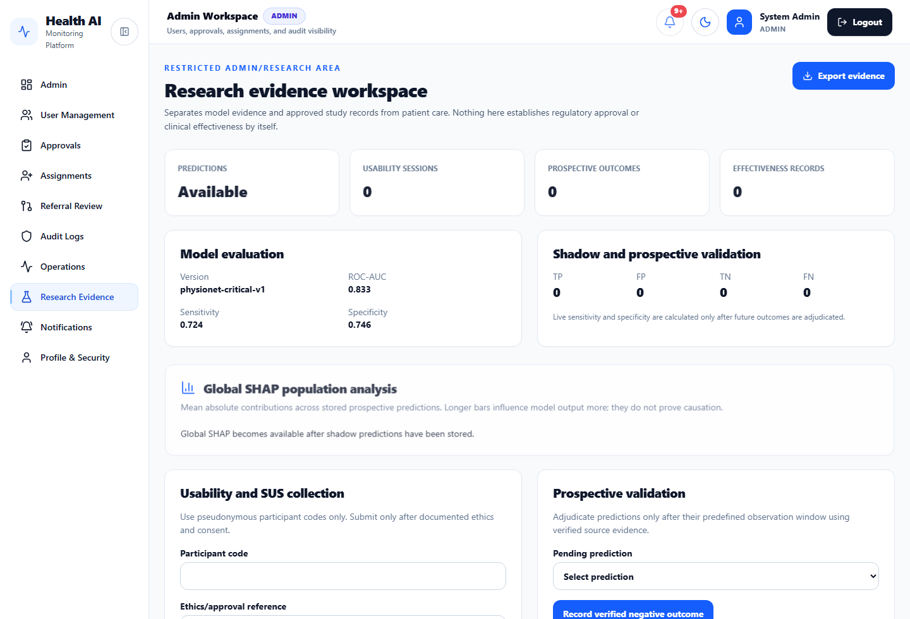
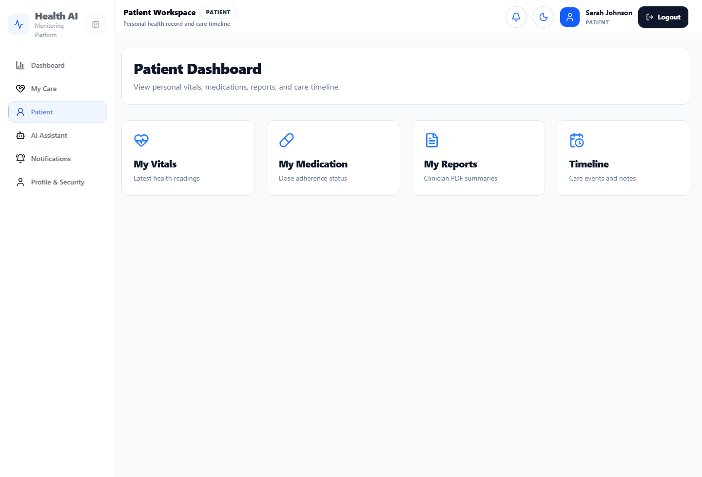
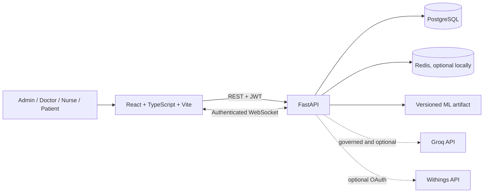

# Health Risk Dashboard

A full-stack clinical monitoring and research prototype for role-based patient review, live observations, care workflows, and explainable risk analysis. It demonstrates production-minded software engineering around sensitive health data without claiming clinical validation or medical-device status.

> **Project status:** Functional portfolio and final-year research prototype. Use synthetic or appropriately governed research data only; the system is not a certified medical device and must not be used to make autonomous clinical decisions.

## What it demonstrates

- Four role-specific experiences for administrators, doctors, nurses, and patients.
- Server-enforced patient access, staff assignments, referrals, registration approval, and audit trails.
- PostgreSQL-backed records for patients, observations, medication, review cases, notifications, and research evidence.
- Live observation updates through authenticated WebSockets, with PostgreSQL as the source of truth and optional Redis fan-out.
- A versioned six-hour critical-event research model with longitudinal features, calibration, Isolation Forest anomaly signals, explanation evidence, drift indicators, and subgroup reporting.
- Optional Groq-assisted summaries and Q&A behind configuration and governance gates, with bounded context, structured output validation, deterministic safety rules, and audit logging.
- CI checks covering migrations, backend tests, frontend lint/build, Playwright browser tests, dependency audit, and secret scanning.

## Screenshots

| Clinician dashboard | Research workspace | Patient view |
|---|---|---|
|  |  |  |

Additional captured screens are retained with the [dissertation evidence](docs/dissertation/).

## Architecture



The frontend centralises authenticated requests and keeps the browser session in `sessionStorage`. FastAPI validates requests, resolves the active user, applies role and patient scope, and only then reads or writes through SQLAlchemy. Alembic owns schema evolution; PostgreSQL is intentionally required.

## Roles and access

| Role | Main responsibilities |
|---|---|
| Admin | Approves access requests, manages users and staff assignments, reviews referrals, audit logs, and operational metrics. Admins are excluded from clinical records. |
| Doctor | Reviews assigned patients, observations, risk outputs, cases, diagnoses, treatment notes, reports, referrals, and escalations. |
| Nurse | Monitors assigned patients, records observations, updates medication state, adds nursing notes, raises alerts, and supports care workflows. |
| Patient | Reads only the patient record linked to their own user account. |

Detailed workflow and compatibility notes are in [Role workflows](docs/architecture/ROLE_WORKFLOWS.md).

## Technology

- **Frontend:** React 19, TypeScript, Vite, React Router, Tailwind CSS, Recharts, Radix UI, Playwright, Axe.
- **Backend:** Python, FastAPI, Pydantic, SQLAlchemy, Alembic, PostgreSQL, JWT, Argon2id, WebSockets.
- **AI and ML:** Groq SDK, scikit-learn, pandas, NumPy, joblib, SHAP, calibrated classification, Isolation Forest.
- **Operations:** Redis, Render blueprint, Vercel configuration, Sentry hooks, encrypted PostgreSQL backup tooling, GitHub Actions, Dependabot, gitleaks.

## Engineering decisions

- **Backend-enforced privacy:** hidden UI elements are not treated as authorisation. Protected routes resolve role and patient-level access centrally and return `404` for inaccessible patients to reduce information leakage.
- **PostgreSQL-only persistence:** local and deployed environments use the same database family; the project does not silently fall back to SQLite.
- **Revocable authentication:** short-lived access tokens are paired with rotating refresh sessions whose identifiers are stored as hashes and revoked on logout or reuse.
- **Durable live workflows:** WebSocket messages provide update hints; persisted PostgreSQL state remains authoritative.
- **Layered AI safety:** emergency rules run independently of the LLM, provider input is reduced and delimited, outputs are schema-validated, and clinical use requires human verification.
- **Traceable ML inference:** runtime output identifies its source and model version. Missing artefacts produce a labelled deterministic fallback rather than a fabricated model probability.

## AI and ML scope

The repository contains two distinct capabilities:

1. **Groq assistant (optional):** uses a pre-trained external model for summaries, questions, handovers, and report text. It is disabled by default and requires both credentials and explicit governance settings for real-data use. No LLM is trained or fine-tuned in this project.
2. **Risk research model:** a committed, versioned scikit-learn artefact predicts a defined critical-vital event in a six-hour horizon. Its retrospective evaluation, limitations, calibration, fairness descriptors, and external-cohort result are documented in the [model card](docs/ML_MODEL_CARD.md). Deterministic safety thresholds remain independent of the model.

These components are decision-support research, not diagnoses. The evidence does not establish prospective clinical effectiveness, generalisation to ordinary outpatient wearables, regulatory approval, or fairness across clinical populations.

## Repository structure

```text
health-risk-dashboard/
├── backend/                 FastAPI app, routes, models, migrations, ML and tests
├── frontend/                React application and Playwright tests
├── docs/                    Architecture, setup, security, testing and research evidence
├── scripts/                 Dissertation source/visual build utilities
├── .github/                 CI and dependency automation
├── render.yaml              Render services, PostgreSQL, Redis and backup job
└── README.md
```

## Run locally

### Prerequisites

- PostgreSQL
- Python 3.12 (the CI/runtime version)
- Node.js 22 (the CI version)

### Backend

From PowerShell:

```powershell
cd backend
python -m venv venv
.\venv\Scripts\Activate.ps1
pip install -r requirements.txt
Copy-Item .env.example .env
```

Set a PostgreSQL `DATABASE_URL` and a unique development `SECRET_KEY` in `backend/.env`, then run:

```powershell
alembic upgrade head
uvicorn main:app --reload
```

The API listens on `http://127.0.0.1:8000`. Create an administrator explicitly; no default production credentials are provided:

```powershell
python scripts/reset_admin.py --email admin@example.com --full-name "System Admin" --password "use-a-unique-password-manager-generated-password"
```

### Frontend

In another terminal:

```powershell
cd frontend
npm ci
Copy-Item .env.example .env.local
npm run dev
```

The application listens on `http://localhost:5173` by default.

## Configuration

Safe, documented placeholders are provided in:

- [`backend/.env.example`](backend/.env.example) for database, authentication, CORS, live updates, AI, Withings, monitoring, and backup settings.
- [`frontend/.env.example`](frontend/.env.example) for the API URL and optional frontend monitoring.

Real `.env` files are ignored. AI and provider integrations remain inactive without configuration. See [Groq setup](docs/setup/AI_SETUP.md), [Withings setup](docs/setup/WITHINGS_SETUP.md), and the full [deployment guide](docs/setup/DEPLOYMENT.md).

## Verification

Backend tests use Pytest and FastAPI TestClient for authentication, access control, request safety, database configuration, assistant safety, backup encryption, early warning, ML, and research-evidence behaviour.

```powershell
cd backend
.\venv\Scripts\Activate.ps1
pytest -q
alembic current
```

Frontend checks include TypeScript compilation, ESLint, a Vite production build, Playwright flows, responsive checks, and Axe accessibility assertions.

```powershell
cd frontend
npm ci
npm run lint
npm run build
npm run test:e2e
```

Authenticated Playwright scenarios require the opt-in environment variables documented in [`frontend/tests/e2e/smoke.spec.ts`](frontend/tests/e2e/smoke.spec.ts). Current and historical evidence must be read separately; see the [claims-versus-code audit](docs/dissertation/CLAIMS_VS_CODE_AUDIT.md) for the latest recorded run and its known browser-test limitations.

## Security

Implemented controls include Argon2id password hashing, strong-password validation, rotating/revocable refresh sessions, role and patient scoping, secure response headers, clinical `no-store` caching, request-size limits, rate limiting, audit logs, production configuration validation, and secret scanning in CI.

The local limiter is process-scoped unless Redis is configured. Production use still requires independent security review, privacy and clinical-safety approval, monitored backups and restore exercises, provider agreements, and operational ownership. See the [security policy](docs/security/SECURITY.md) and [deployment checklist](docs/setup/DEPLOYMENT_CHECKLIST.md).

## Documentation

- [Documentation index](docs/README.md)
- [Research architecture](docs/RESEARCH_ARCHITECTURE.md)
- [Model card](docs/ML_MODEL_CARD.md)
- [Formal test matrix](docs/FORMAL_TEST_MATRIX.md)
- [Validation and generalisation plan](docs/VALIDATION_AND_GENERALISATION.md)
- [Regulatory preparation boundary](docs/REGULATORY_PREPARATION.md)
- [Dissertation and reproducible evidence](docs/DISSERTATION_EVIDENCE.md)

## Known limitations

- This is a portfolio/research prototype, not a clinically validated or regulated product.
- The committed ML evidence is retrospective and population-specific; false-positive burden and subgroup uncertainty remain material.
- Groq and Withings require external accounts, credentials, governance approval, and deployment configuration.
- In-process behaviour and repository scripts do not prove sustained production reliability, successful disaster recovery, or completed human-factor evaluation.
- The latest recorded Playwright rerun is not fully green; see the linked audit for the exact result and causes under investigation.

## Author

Michael Etonyeaku
