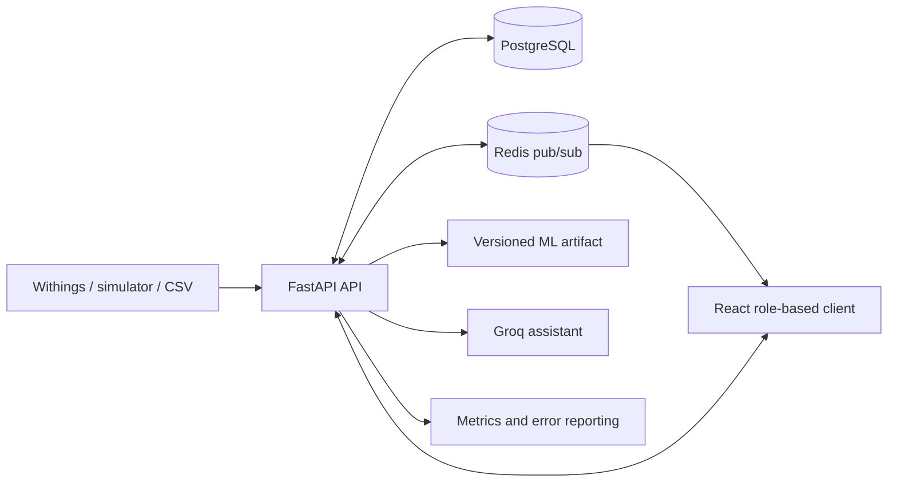
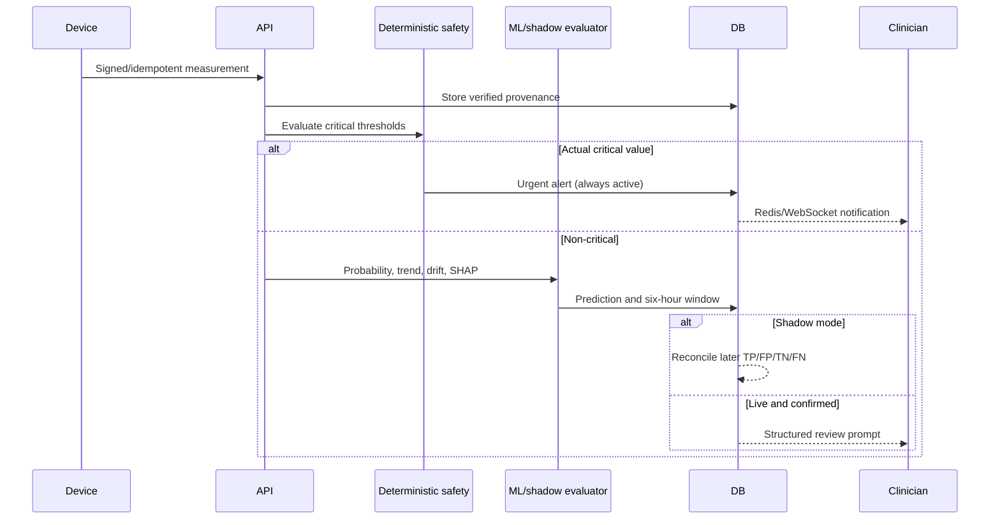
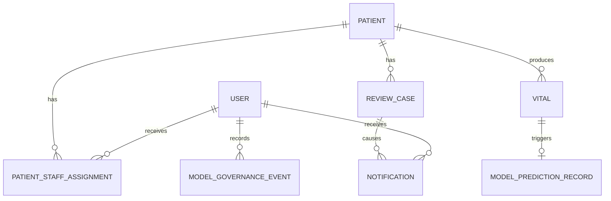

# Dissertation implementation evidence

## Architecture

## Clinical data and alert flow

## Threat model

| Threat | Principal control | Evidence |
|---|---|---|
| Cross-patient disclosure | Assignment-scoped authorization on every patient endpoint | Security API tests and audit logs |
| Forged/replayed device event | OAuth/webhook validation and event deduplication | Integration route and replay test |
| Prompt injection in notes | Patient content is untrusted data; controlled retrieval and strict output schema | Assistant safety tests |
| Stolen session | Expiry, revocation, MFA/session controls, HTTPS-only production cookies | Authentication routes and security headers |
| Alert lost across instances | PostgreSQL state plus Redis broadcast; polling recovery | Notification and readiness checks |
| Unsafe model population | Drift measurement, version approval, shadow mode and automatic suspension | Governance history and prediction records |

## Entity relationships

## ML pipeline

```mermaid
flowchart LR
  A[Licensed longitudinal dataset] --> B[Patient-grouped split]
  B --> C[Rolling and variability features]
  C --> D[Candidate models]
  D --> E[Calibration]
  E --> F[Clinically costed threshold]
  F --> H[Test and external validation]
  H --> I[Versioned artifact + model card]
  I --> J[Shadow mode]
  J --> K[Live only after approval]
  K --> L[Drift and outcome monitoring]
```

## Quantitative evidence

The authoritative numeric evidence is generated in `backend/artifacts/ml/evaluation.json`, including the confusion matrix, ROC-AUC, PR-AUC, Brier score, calibration points, fairness tables and external-validation result. The interface exposes patient-level SHAP contributions. These values must be copied into the final dissertation with the model version and dataset hash, not transcribed from memory.

Usability-result tables must come from real participant records under `docs/USABILITY_EVALUATION.md`. Empty or fabricated results must never be presented as completed evaluation.

## Deployment and testing appendix checklist

- Commit SHA, artifact model version and dataset SHA-256
- Render/Vercel build identifiers and migration revision
- Backend, frontend, browser and accessibility results
- Shadow-mode duration and TP/FP/TN/FN counts
- Alerts per 100 monitored patients, acknowledgement and resolution times
- Redis, Groq, PostgreSQL restart and backup-restore exercises
- Known limitations, incidents and unresolved risks
